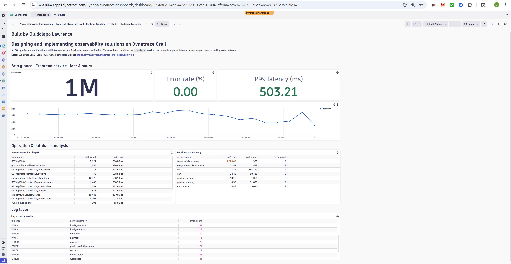
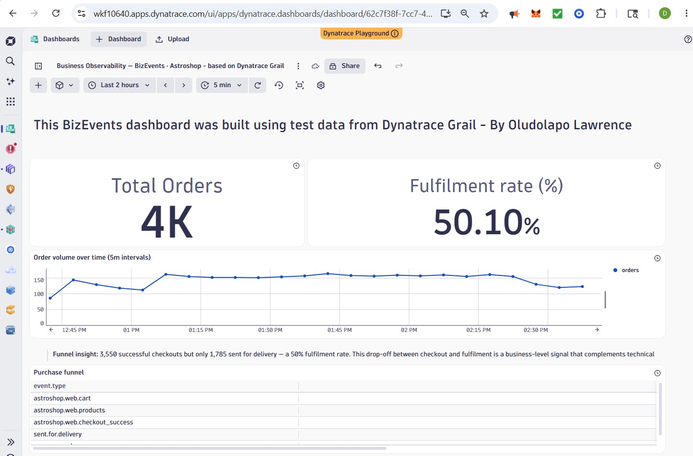

# Dynatrace-Grail-Observability
# Payment Services Observability — Dynatrace Grail

End-to-end observability solution for payment transaction monitoring, built natively on Dynatrace Grail. All DQL queries were authored and validated against live Grail span, log, and entity data in the Dynatrace Playground environment.

> Inspired by a real production incident where clients were unable to complete payment card transactions. Davis AI detected requests queuing with connection timeout errors. DQL span queries on Grail confirmed Oracle database connection pool exhaustion — p99 DB span latency had spiked 400% above baseline. This dashboard and SRG configuration would have reduced MTTD from hours to minutes.

---

## Dashboard

### Payment Services Observability — Frontend · Grail


### Business Observability — BizEvents · Astroshop


---

## Architecture

| Component | Technology |
|---|---|
| Platform | Dynatrace SaaS (Grail) |
| Query language | DQL (Dynatrace Query Language) |
| Dashboards | Gen3 |
| Tracing | Traces on Grail / Spans |
| Quality gates | Site Reliability Guardian (SRG) |
| Automation | Dynatrace Workflows |

---

## Repo structure

```
dql-queries/
  service-health.dql          — total requests, error rate, p95/p99 latency
  database-span-latency.dql   — connection pool saturation monitoring
  log-error-analysis.dql      — ERROR/WARN log patterns by service
  throughput-timeseries.dql   — makeTimeseries request trend (5m intervals)
  slowest-operations.dql      — top 15 operations by p99 latency
  apdex-score.dql             — Apdex score with calibrated T threshold

dashboards/
  payment-services.json       — exportable Gen3 dashboard definition

srg/
  payment-guardian.md         — SRG objective definitions and rationale

workflows/
  deployment-gate.md          — SRG-triggered Workflow design
```

---

## Key DQL queries

### Service health overview
```
fetch spans, from: now()-2h
| filter service.name == "frontend"
| summarize
    total_requests = count(),
    errors         = countIf(isError == true),
    error_rate     = round(toDouble(countIf(isError == true)) / count() * 100, decimals: 2),
    p99_ns         = percentile(duration, 99)
| fieldsAdd p99_ms = round(toDouble(p99_ns) / 1000000, decimals: 2)
| fields total_requests, errors, error_rate, p99_ms
```

### Database connection pool monitoring
```
fetch spans, from: now()-2h
| filter isNotNull(db.statement) or isNotNull(db.system)
| summarize
    p99_ms      = round(toDouble(percentile(duration, 99)) / 1000000, decimals: 3),
    call_count  = count(),
    error_count = countIf(isError == true),
    by: { service.name }
| sort p99_ms desc
```

### Request throughput timeseries (Gen3 line chart tile)
```
fetch spans, from: now()-2h
| filter service.name == "frontend"
| makeTimeseries requests = count(), interval: 5m
```

### Log error analysis
```
fetch logs, from: now()-2h
| filter loglevel == "ERROR" or loglevel == "WARN"
| summarize error_count = count(), by: { loglevel, service.name }
| sort error_count desc
| limit 20
```

### Slowest operations by p99
```
fetch spans, from: now()-2h
| filter service.name == "frontend"
| summarize
    call_count = count(),
    p99_ms     = round(toDouble(percentile(duration, 99)) / 1000000, decimals: 3),
    by: { span.name }
| sort p99_ms desc
| limit 15
```

---

## DQL notes

- Duration in Grail spans is stored in **nanoseconds**. Always divide by `1,000,000` for milliseconds.
- Wrap with `toDouble()` before division to strip the duration type metadata and prevent the Dynatrace UI from auto-formatting back to nanoseconds.
- `makeTimeseries` produces a continuous series filling empty intervals — prefer it over `summarize + bin()` for chart tiles.
- `by:` must be **inline** on the same line as `summarize` in some Dynatrace environments.

---

## SRG quality gate objectives

| Objective | Comparison | Warning | Fail |
|---|---|---|---|
| Error rate | Absolute | > 1% | > 2% |
| P99 latency | Relative | > 10% above baseline | > 20% above baseline |
| DB span p99 | Relative | > 20% above baseline | > 30% above baseline |
| Apdex score | Absolute | < 0.90 | < 0.85 |

See `srg/payment-guardian.md` for full objective DQL and rationale.

---
